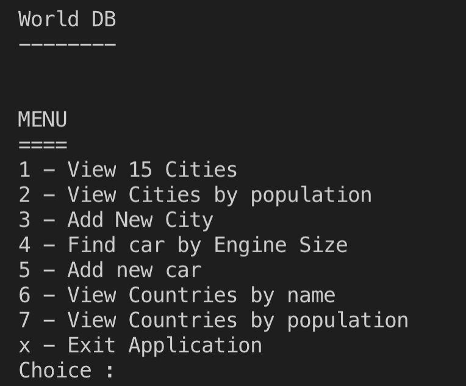
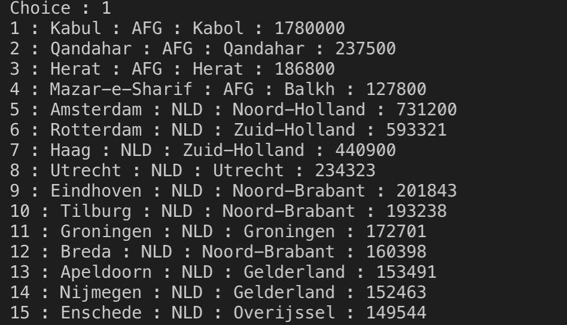
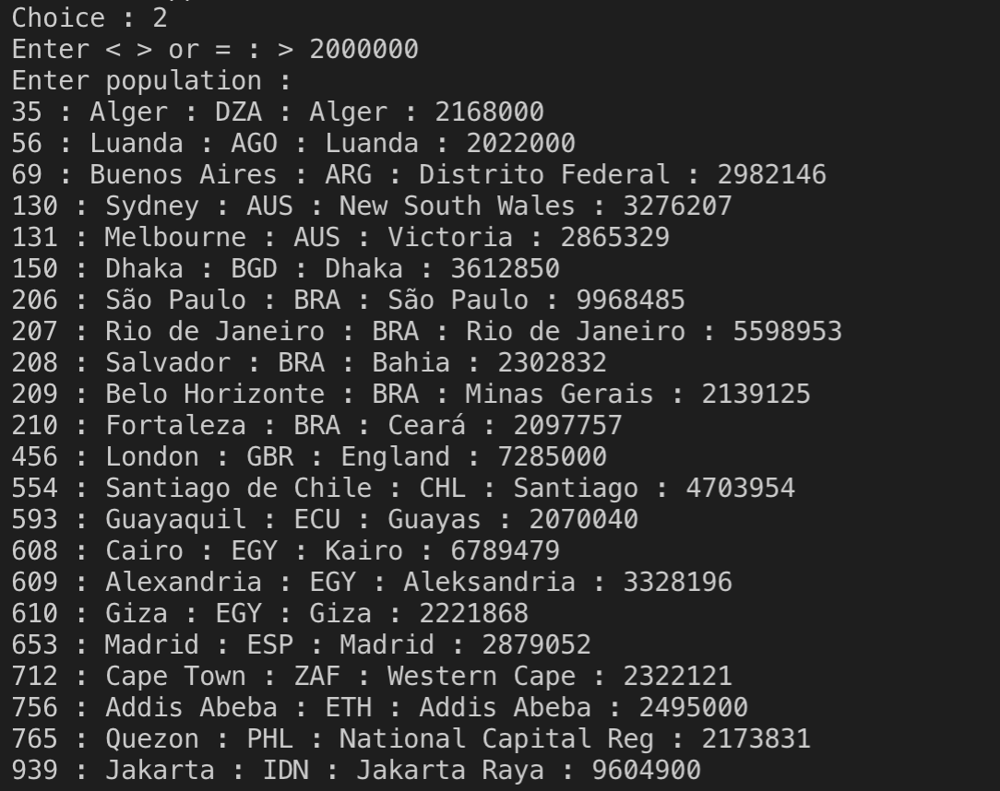
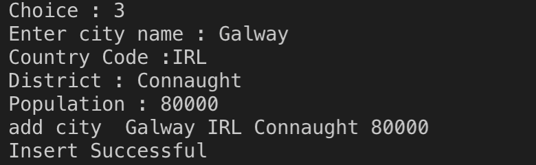
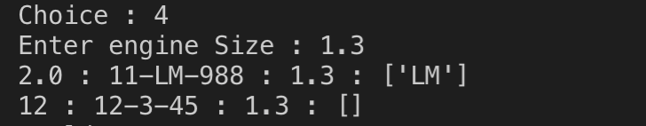
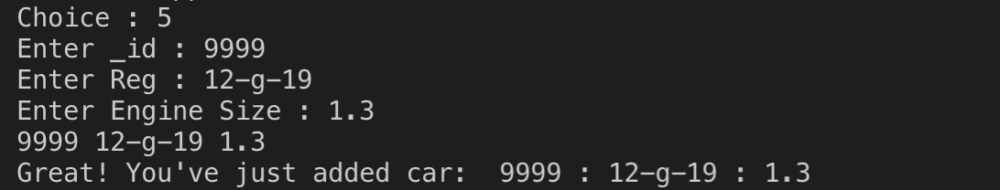
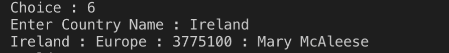
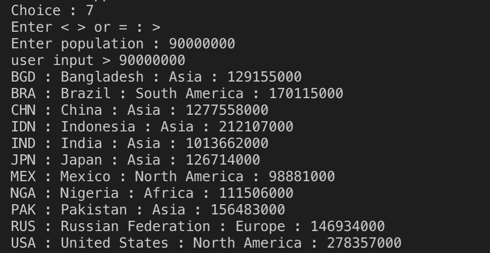

# Little Python Application
Applied Databases, Semester 3, GMIT 2019

Python application using pymysql(https://pymysql.readthedocs.io/en/latest/) and pymongo (https://api.mongodb.com/python/current/)

Two separate Databases
1. world.sql - connect using pymysql
2. mongo.json  - connect using pymongo 

Select your choice to interact with a database

## PyMySQL
Select Choice 1 - View 15 Cities

connects using pymysql world database and reads the data

Select Choice 2 - View Cities by Population

Select Choice 3 - Add a new city

Creates a new city and adds it to the database

## PyMongo

Select Choice 4 - Find car by Engine Size

Reads MongoDB database using PyMongo

Select Choice 5 - Add new car

Creates a new car in the database

## PyMySQL

Select Choice 6 - View Countries by Name

Select Choice 7 - View Countries by Population

